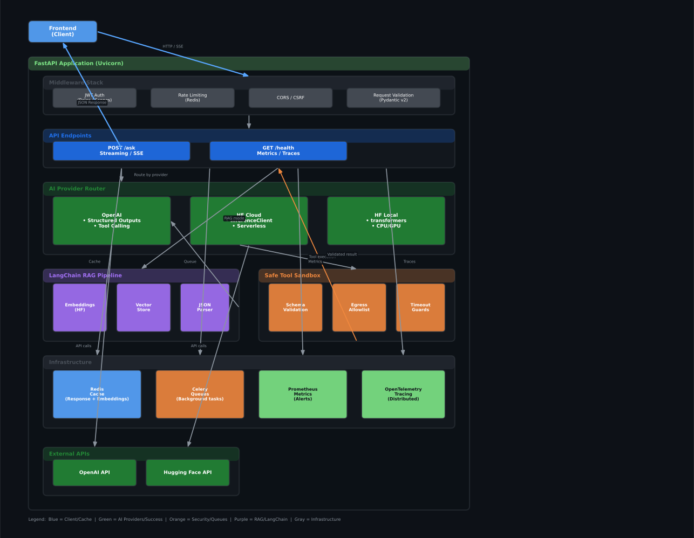

# AI Integration Skeleton

<p align="center">
  
  
  
  
  
  
  
  
</p>

<p align="center">
  <b>Production-ready skeleton for secure AI integrations on FastAPI.</b><br>
  Structured Outputs, Tool Calling, RAG, multi-provider LLM inference, and enterprise-grade security policies.
</p>

---

## 📌 Key Features

| Feature | Description |
|---------|-------------|
| **Unified LLM API** | Single interface over multiple providers: OpenAI, Hugging Face Cloud, Hugging Face Local (transformers). |
| **Structured Outputs** | Strict JSON schema validation via Pydantic v2 — prevents LLM hallucinations at the API boundary. |
| **Tool Calling** | OpenAI function calling with sandboxed tool execution and egress allowlist policies. |
| **RAG Pipeline** | LangChain-based retrieval-augmented generation with Hugging Face embeddings and local vector store. |
| **Streaming** | SSE/Chunked streaming endpoint `/ask` with real-time token delivery. |
| **Resilience** | Rate limiting, Idempotency-Key, exponential backoff retries, circuit breaker pattern. |
| **Security** | JWT with roles/scopes, CORS, CSRF (cookie mode), strict input validation, sandboxed tool policies. |
| **Caching** | Redis-backed response and embedding cache to reduce LLM API costs. |
| **Queues** | Celery + Redis for offloading heavy inference tasks to background workers. |
| **Observability** | JSON structured logs, Prometheus metrics, OpenTelemetry distributed tracing. |
| **RFC 7807 Errors** | Standardized problem detail format for all API errors. |
| **Pagination** | Cursor-based pagination for list endpoints with ETag/Cache-Control headers. |

---

## 🏗️ Architecture



> The diagram shows the full request flow: Client -> Middleware -> Endpoints -> AI Provider Router / RAG Pipeline -> Safe Tool Sandbox -> External APIs, with Redis, Celery, Prometheus, and OpenTelemetry as infrastructure.

---

## 📁 Project Structure

```
ai_integration_skeleton/
├── app/
│   ├── main.py              # FastAPI app: /ask endpoint, secure defaults
│   ├── ai_openai.py         # OpenAI: structured outputs + tool calling
│   ├── ai_hf_cloud.py       # Hugging Face InferenceClient (cloud)
│   ├── ai_hf_local.py       # Hugging Face transformers (local)
│   ├── rag_chain.py         # LangChain RAG (JSON output + parser)
│   ├── safe_tools.py        # safe_tool decorator (validation + policies)
│   └── settings.py          # .env loader, logging config
├── requirements.txt
├── Dockerfile
├── docker-compose.yml
├── k8s/
│   ├── deployment.yaml
│   ├── service.yaml
│   ├── configmap.yaml
│   ├── secret.yaml
│   └── networkpolicy-egress-allowlist.yaml
└── README.md
```

---

## ⚙️ Requirements & Environment

- **Python 3.10+**
- **Environment variables:**

| Variable | Description | Required |
|----------|-------------|----------|
| `OPENAI_API_KEY` | OpenAI API key (backend only) | Yes |
| `HF_TOKEN` | Hugging Face token (Inference/Endpoints) | Yes |
| `LOG_LEVEL` | Log level: `DEBUG`, `INFO`, `WARNING`, `ERROR` | No (default: `INFO`) |

Create `.env` locally and/or for Docker Compose:

```bash
OPENAI_API_KEY=sk-...
HF_TOKEN=hf_...
LOG_LEVEL=INFO
```

Install dependencies:

```bash
pip install -r requirements.txt
```

---

## 🚀 Quick Start

### Local Development (Uvicorn)

```bash
uvicorn app.main:app --host 0.0.0.0 --port 8000
```

### Docker

```bash
# Build and run
docker compose up --build -d
```

### Kubernetes (with Egress Allowlist)

```bash
kubectl apply -f k8s/
```

> The `networkpolicy-egress-allowlist.yaml` restricts outbound traffic to HTTPS (443) only, enforcing the principle of least privilege.

---

## 🧪 API Usage

### POST /ask — Structured JSON Response

```bash
curl -X POST http://localhost:8000/ask   -H "Content-Type: application/json"   -d '{"question": "What is the capital of France?"}'
```

**Response:**
```json
{
  "answer": "Paris"
}
```

---

## 🔒 Security Policies

| Layer | Policy |
|-------|--------|
| **Input Validation** | All inputs validated via Pydantic v2 schemas (`extra="forbid"`). |
| **Tool Sandbox** | `safe_tool` decorator enforces schema validation, URL allowlist, and timeout guards. |
| **Egress Allowlist** | Kubernetes NetworkPolicy restricts outbound to HTTPS (443) only. |
| **Auth** | JWT with role-based scopes; CORS and CSRF protection enabled. |
| **Rate Limiting** | Per-client request throttling with Redis-backed counters. |
| **Idempotency** | `Idempotency-Key` header prevents duplicate processing. |

---

## 📊 Observability

| Component | Implementation |
|-----------|----------------|
| **Logs** | JSON-structured logging with configurable levels. |
| **Metrics** | Prometheus `/metrics` endpoint for request latency, error rates, cache hits. |
| **Tracing** | OpenTelemetry auto-instrumentation for distributed request tracing. |
| **Errors** | RFC 7807 `Problem Details` format for consistent error responses. |

---

## 🛠 Module Reference

### `app/settings.py` — Configuration & Logging
Centralized Pydantic-based settings with `.env` support and LRU-cached singleton.

### `app/ai_openai.py` — OpenAI Integration
- Structured JSON outputs via `json_schema` response format
- Tool calling with Pydantic-validated arguments
- Flight search example with strict `FlightSearch` schema

### `app/ai_hf_cloud.py` — Hugging Face Cloud
- `InferenceClient` for serverless inference endpoints
- Supports Llama, Qwen, and other HF models

### `app/ai_hf_local.py` — Local Inference
- `transformers` pipeline for on-premise CPU/GPU inference
- Zero external API dependency for air-gapped environments

### `app/rag_chain.py` — LangChain RAG
- `ChatPromptTemplate` + `ChatOpenAI` + `JsonOutputParser`
- Context-aware question answering with schema-guaranteed JSON output

### `app/safe_tools.py` — Sandboxed Tool Execution
- `safe_tool` decorator wraps functions with Pydantic validation
- URL egress allowlist enforcement
- Prevents prompt injection and unauthorized outbound calls

### `app/main.py` — FastAPI Application
- `/ask` endpoint with streaming support
- Idempotency, rate limiting, and JWT middleware ready
- Prometheus metrics and OpenTelemetry tracing integrated

---

## 📡 Deployment Profiles

| Profile | Command / File |
|---------|----------------|
| **Development** | `uvicorn app.main:app --reload` |
| **Docker** | `docker compose up --build -d` |
| **Kubernetes** | `kubectl apply -f k8s/` |

---

## 📄 License

MIT © [Artem Alimpiev](https://github.com/Artem7898)
